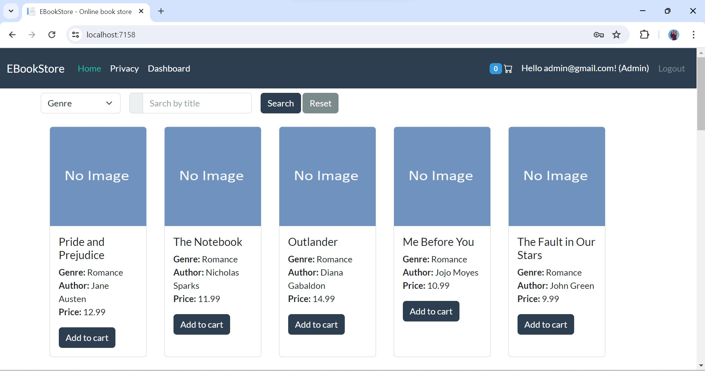

# BookShoppingCartMvc (A basic e-comm system for beginners)📚🛒

## Tech stack 🧑‍💻

   - Dotnet core mvc (.Net 8)
   - MS SQLServer (Database)
   - Entity Framework Core (ORM)
   - Identity Core (Authentication)
   - Bootstrap 5 (frontend)

## Video tutorial 📺

[Youtube playlist](https://www.youtube.com/watch?v=R4ZLWD89R5w&list=PLP8UhDwXI7f_8r2Rbt7GNwf7eXZqUu_p4)

## How to run the project?🌐

I am assuming that, you have already installed **Visual Studio 2022** (It is the latest as of march,2024) and **MS SQL Server Management Studio** (I am using mssql server 2022 as of march,2024). Now, follow the following steps.

1.Open command prompt. Go to a directory where you want to clone this project. Use this command to clone the project.

```bash
git clone https://github.com/rd003/BookShoppingCart-Mvc
```

2.Go to the directory where you have cloned this project, open the directory `BookShoppingCart-Mvc`. You will find a file with name `BookShoppingCartMvc.sln`. Double click on this file and this project will be opened in Visual Studio.

3.Open `appsettings.json` file and update connection string

```json
"ConnectionStrings": {
  "conn": "data source=your_server_name;initial catalog=MovieStoreMvc; integrated security=true;encrypt=false"
}
```

4.Delete `Migrations` folder.

5.Open Tools > Package Manager > Package manager console

6.Run these 2 commands (works only with Visual studio)

```bash
  add-migration init

  update-database
```

7.Now you can run this project.

## How to register as admin and login?? 🧑‍💻🧑‍💻

1.Open the `Program.cs` file , you will find these commented lines

```c#
//using(var scope = app.Services.CreateScope())
//{
//    await DbSeeder.SeedDefaultData(scope.ServiceProvider);
//}
```

Uncomment these line and run the project. `Now stop the project and comment these lines again.`

2.Now click on login and login with these credentials.

```text
username: admin@gmail.com

password: Admin@123
```

## Data Entry 📈📉

I have provided some data of these 3 tables to test the application.

**⚠️Note: Data entry of Genre and Book is optional, you can do it from admin panel but you must enter some data for OrderStatus.**

- Genre (You can also add it from the admin panel)
- Book (You can also add it from the admin panel)
- OrderStatus (⚠️It Contain Constants. You Can not enter OrderStatus from the Admin panel. It must be added through sql server)

Please, run these scripts in a order. Genre data must be added before book.


## Other useful sql scripts

You also need to add this stored procedure in your database.

```sql
create  procedure [dbo].[Usp_GetTopNSellingBooksByDate]
@startDate datetime,@endDate datetime
as
begin

SET NOCOUNT ON;

with UnitSold as
(
select od.BookId, SUM(od.Quantity) as TotalUnitSold from [order] o 
join OrderDetail od on o.Id = od.OrderId
where o.IsPaid=1 and o.IsDeleted=0 and o.CreateDate between @startDate and @endDate
group by od.BookId
)

select top 5 b.BookName,b.AuthorName,b.[Image],us.TotalUnitSold 
from  UnitSold us
join [Book] b
on us.BookId = b.Id
order by us.TotalUnitSold desc
end
```

## Screenshots

1.Homepage


2.Homepage continued


3.Login


4.Registration


5.Add To Cart


6.Cart


7.Checkout


8.Order success


9.Admin Login



10.Admin Dashboard


11.Orders


12.Order Detail


13.Update Order Status


14.Display Stock


15.Update Stock


16.Display Genre


17.Add Genre


18.Update Genre


19.Display Books


20.Add Book


21.Update Book


22.Top Selling Books


